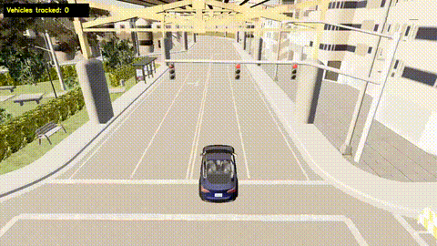
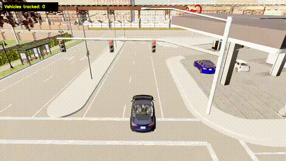

# CARLA Multi-Object Tracking with DeepSORT

A real-time multi-object tracking pipeline for the CARLA simulator. Detects vehicles using YOLOv8, tracks them across frames with DeepSORT (Hungarian algorithm + Kalman filter + ReID embeddings), estimates speed, draws motion trajectories, and records the output as a video.

Built with SOLID principles — every component (detector, tracker, speed estimator, renderer, recorder, spawner) is an interface-based, swappable module wired together in `pipeline.py` and `main.py`.

## Features

- **Detection**: YOLOv8 (`yolov8n.pt`) restricted to vehicle classes (car, bus, truck)
- **Tracking**: DeepSORT — Hungarian algorithm for detection-to-track assignment, Kalman filter for motion prediction, CNN embeddings for appearance-based re-identification
- **Trajectory visualization**: fading motion trails per tracked vehicle
- **HUD overlay**: live count of tracked vehicles
- **Chase camera**: an unattached RGB camera follows the ego vehicle, positioned above and behind it and oriented along the vehicle's heading (road-normal), updated every simulation tick
- **Video recording**: saves the annotated simulation feed to `recordings/`
- **CARLA world setup**: spawns an ego vehicle, populates the world with NPC traffic via the Traffic Manager, and places a chase camera following the ego vehicle

## Project Structure

```
.
├── main.py              # Entry point — wires everything together
├── pipeline.py          # TrackingPipeline orchestrator
├── detector.py          # YOLODetector (IDetector)
├── tracker.py           # DeepSortTracker (ITracker)
├── trajectory.py         # InMemoryTrajectoryStore, FadingLineRenderer
├── renderer.py          # BoundingBoxRenderer, HUDRenderer, CompositeRenderer
├── recorder.py          # OpenCVVideoRecorder, NullVideoRecorder (IVideoRecorder)
├── spawner.py           # World/actor spawning (ego, NPC traffic, chase camera)
├── utils.py             # CARLA image conversion helpers
└── recordings/          # Output videos (created at runtime)
```

## Requirements

- CARLA simulator (0.9.x) running and listening on `localhost:2000`
- Python 3.8+

```bash
pip install carla ultralytics deep-sort-realtime opencv-python numpy --break-system-packages
```

> The `carla` PyPI package version must match your CARLA server version. If `pip install carla` fails, use the `.whl` shipped in your CARLA installation's `PythonAPI/carla/dist/` folder instead.

## Usage

1. Start the CARLA server:

```bash
./CarlaUE4.sh
```

2. Run the tracking pipeline:

```bash
python main.py
```

3. Press `q` to stop. The annotated video is saved automatically to `recordings/sim_<timestamp>.mp4`.

## Configuration

Key parameters are set in `main.py`:

| Parameter | Location | Default | Description |
|---|---|---|---|
| `town` | `world_factory.create_world()` | `Town03` | CARLA map to load |
| `num_vehicles` | `TrafficSpawner(...)` | `20` | Number of NPC vehicles |
| `width`, `height` | `ChaseCameraSpawner(...)` | `1280x720` | Camera/output resolution |
| `height_z` | `ChaseCameraSpawner(...)` | `8.0` | Camera height above the ego vehicle (meters) |
| `back_distance` | `ChaseCameraSpawner(...)` | `10.0` | Distance behind the ego vehicle along its heading (meters) |
| `pitch` | `ChaseCameraSpawner(...)` | `-25.0` | Downward camera tilt (degrees) |
| `FPS` | `main()` | `30` | Simulation tick rate and video FPS |
| `classes` | `YOLODetector(...)` | `[2, 5, 7]` | YOLO classes (car, bus, truck) |
| `conf_threshold` | `YOLODetector(...)` | `0.5` | Minimum detection confidence |
| `max_age`, `n_init`, `nn_budget` | `DeepSortTracker(...)` | `30, 3, 100` | DeepSORT tracking parameters |
| `record` | `main(record=True)` | `True` | Toggle video recording on/off |

## Results
### Town01



### Town02


